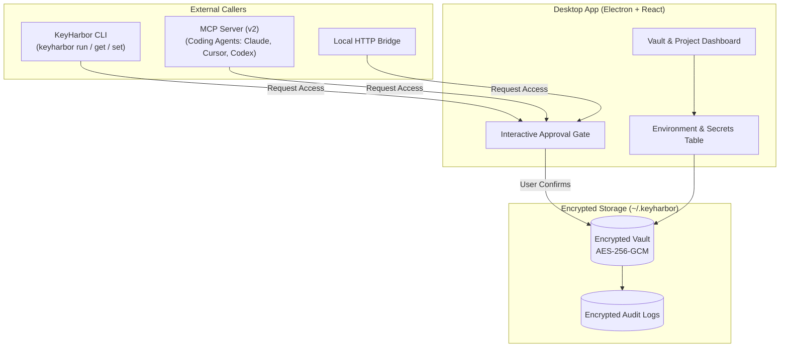

<div align="center">


# KeyHarbor

**A local-first, zero-knowledge secrets workspace and configuration manager for developers and AI coding agents.**

[](https://github.com/varunyn/KeyHarbor) [](https://github.com/varunyn/KeyHarbor) [](https://modelcontextprotocol.io) [](LICENSE)

</div>

---

KeyHarbor gives developers a safe, encrypted space to manage application credentials, validate `.env` requirements, and inject secrets into CLI commands or AI workflows. Every secret read or write through external tools requires deliberate, interactive approval—keeping credentials off the cloud, out of prompt logs, and protected from silent exfiltration.

**100% free to use. Works entirely offline with no accounts, subscriptions, or telemetry.**
---

## Highlights

- 🔒 **Zero-Knowledge Local Encryption**: Vaults are encrypted at rest with AES-256-GCM using authenticated key derivation. Biometric unlock supported via Touch ID on macOS.
- 🛡️ **Interactive Approval Gates**: Any external caller—whether the CLI, the MCP server, or the local HTTP bridge—triggers a desktop approval prompt detailing the requesting process, target project, and environment. No background exfiltration.
- 🤖 **Model Context Protocol (MCP v2)**: Built-in stdio MCP server enabling AI coding assistants (Claude Code, Cursor, Codex, etc.) to safely list, inspect, and set project secrets under human review.
- 📁 **Project & Environment Isolation**: Organize credentials hierarchically (`Vault → Project → Environment → Secrets`). Maintain independent `dev`, `staging`, and `prod` configurations without accidental value bleed or fallback.
- ✅ **Configuration Baseline Checks**: Audit environments against `.env.example` templates. Instantly see whether required variables are **Ready**, **Missing**, **Empty**, or **Expired**.
- 🔄 **Safe Import & Export**: Parse `.env` files up to 1 MiB / 5,000 assignments with masked visual reviews and explicit conflict resolution. Export keys-only templates, secret references, or encrypted backups.
- 📜 **50-Version History & Point-in-Time Rollback**: View granular change history and revert any credential to previous versions with a single click.
- 🚫 **100% Offline & Private**: Core operations run on your machine. No accounts, no analytics, no cloud backends.

---

## Architecture & Workflow



---

## Quick Start

### Prerequisites

- **Node.js**: `20.19+` or `>= 22.12`
- **npm**: `10+`
- **OS**: macOS 13+ (Apple Silicon & Intel), Windows 10+ (x64 / arm64), or Linux (64-bit)

### Running from Source

```bash
# Clone repository
git clone https://github.com/varunyn/KeyHarbor.git
cd KeyHarbor

# Install dependencies
npm install

# Start the application
npm start
```

### Packaging Binaries

To produce standalone installers:

```bash
# macOS (.dmg)
npm run build:mac

# Windows (.exe / NSIS)
npm run build:win

# Linux (.AppImage)
npm run build:linux
```

---

## CLI Reference

The KeyHarbor CLI allows you to read, write, and inject credentials into terminal commands. The desktop app must be running and unlocked; commands will trigger an interactive approval dialog before executing.

```bash
# List all accessible projects
keyharbor list

# Retrieve a specific secret (returns JSON with value and expiration)
keyharbor get myapp DATABASE_URL --env=prod

# Set or update a secret (requires write approval)
keyharbor set myapp STRIPE_KEY "sk_live_123456789" --env=prod

# Run a process with secrets injected directly into its environment
keyharbor run --project=myapp --env=dev -- npm run dev

# Omitting --env defaults to the project's designated default environment
keyharbor run --project=myapp -- docker compose up
```

---

## AI Assistant & MCP Integration

KeyHarbor ships with a Model Context Protocol (MCP v2) server over stdio. AI coding agents can inspect configuration requirements and read or set secrets under strict user approval.

### 1. Enable CLI / MCP in Settings

In the KeyHarbor desktop app, open **Settings** and ensure the CLI helper is installed, or build the backend locally with `npm run build:backend`.

### 2. Configure Your AI Client

#### Codex (`~/.codex/config.toml`)

```toml
[mcp_servers.keyharbor]
command = "keyharbor"
args = ["mcp"]
default_tools_approval_mode = "writes"
tool_timeout_sec = 60
```

#### Claude Desktop (`claude_desktop_config.json`)

```json
{
  "mcpServers": {
    "keyharbor": {
      "command": "keyharbor",
      "args": ["mcp"]
    }
  }
}
```

#### Cursor (`Settings → Features → MCP`)

- **Name**: `keyharbor`
- **Type**: `command`
- **Command**: `keyharbor mcp`

### Exposed Tools

- `keyharbor_status`: Check daemon status and vault unlock state.
- `list_projects`: Discover available projects and environments.
- `create_project`: Create a new project workspace.
- `list_secret_keys`: Enumerate key names in a project environment (metadata-only, requires read approval).
- `get_secret` / `get_secrets`: Fetch one or more secret values (prompts desktop approval).
- `set_secrets`: Store or update one or multiple secrets in batch (prompts desktop approval).

---

## Key Concepts

### Projects & Environments

- **Hierarchy**: Vaults contain **Projects**, which contain **Environments** (`default`, `dev`, `staging`, `prod`, etc.), which hold **Secrets**.
- **Isolation**: Each environment is strictly isolated. A missing variable in `prod` will never silently fall back to `dev`.
- **Default Resolution**: Every project specifies a persistent default environment. External requests (CLI, MCP, HTTP) that omit the `--env` flag target this default rather than whichever environment is active in the desktop GUI.

### Configuration Checklist & Auditing

- Define expected keys for any environment by pasting a `.env.example` file or uploading a template.
- The checklist classifies each requirement into one of four states:
  - 🟢 **Ready**: Key exists, holds a non-empty value, and has not expired.
  - 🟡 **Empty**: Key is defined but contains an empty string.
  - 🔴 **Missing**: Key is absent from the selected environment.
  - ⏰ **Expired**: Key has exceeded its recorded expiration date.

### Safe `.env` Import & Export

- **Parser Engine**: Safely processes UTF-8 files up to 1 MiB and 5,000 assignments. Supports quotes, multiline values, comments, and `export` prefixes.
- **Review Screen**: Values remain masked by default. Highlights diffs, duplicate occurrences, and novel keys with Add/Keep/Skip controls before committing to disk.
- **Export Formats**:
  1. `.env.example` (keys-only baseline)
  2. Safe reference links (`keyharbor://project/KEY?environment=dev`)
  3. Encrypted project backups (`.lkvb`)
  4. Raw text export (requires master password verification and emits an audit event)

---

## Security & Storage Model

- **Vault Encryption**: Encrypted using AES-256-GCM. Salt and key derivation parameters are stored alongside the vault.
- **Data Location**: Stored locally in `~/.keyharbor`. Installations migrated from previous versions will seamlessly read existing data from `~/.localkeys` without moving files or invalidating backups.
- **Access Logs**: Encrypted internal log tracking read, write, unlock, and lock operations with timestamps and caller identification.
- **Memory Hygiene**: Secrets displayed in the desktop app auto-mask after 30 seconds or when the window loses focus.

---

## Development & Testing

### Project Structure

```text
├── cli/                 # Stdio CLI and MCP v2 server implementations
├── src/
│   ├── main.ts          # Electron main process entry point
│   ├── preload.ts       # Typed contextBridge IPC interface
│   ├── modules/         # Vault crypto, storage, HTTP server, and logger
│   ├── dashboard/       # React views for Vault and Project management
│   ├── project/         # React views for Secrets table, imports, & checks
│   ├── renderer/        # Shared React components, Radix UI, & i18n
│   └── styles/          # Tailwind CSS and theme tokens
├── test/                # Unit and integration test suites
```

### Commands

| Command | Description |
| --- | --- |
| `npm start` | Builds renderer & backend, then launches Electron |
| `npm run test` | Executes unit tests via Node test runner |
| `npm run check` | Runs Ultracite read-only code quality & style checks |
| `npm run check:backend` | Validates TypeScript types and backend linting |
| `npm run fix -- <path>` | Formats a specific file using Oxfmt |
| `npm run build:backend` | Compiles backend TypeScript to `backend-build/` |
| `npm run build:renderer` | Compiles React views and assets via Vite |

## License

This project is licensed under the [MIT License](LICENSE).
